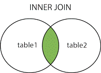
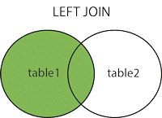
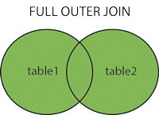

### Different Types of SQL JOINs
Here are the different types of the **JOINs** in **SQL**:
1. **(INNER) JOIN**: Returns records that have matching values in both tables.
2. **LEFT (OUTER) JOIN**: Return all records from the left table, and the matched records from the right table.
3. **RIGHT (OUTER) JOIN**: Return all records from the right table, and the matched records from the left table.
4. **FULL (OUTER) JOIN**: Return all records when there is a match in either left or right table.

5. **CROSS JOIN**: The SQL CROSS JOIN produces a result set which is the number of rows in the first table multiplied by the number of rows in the second table if no WHERE clause is used along with CROSS JOIN.This kind of result is called as Cartesian Product. 
If WHERE clause is used with CROSS JOIN, it functions like an INNER JOIN. 
An alternative way of achieving the same result is to use column names separated by commas after SELECT and mentioning the table names involved, after a FROM clause.
