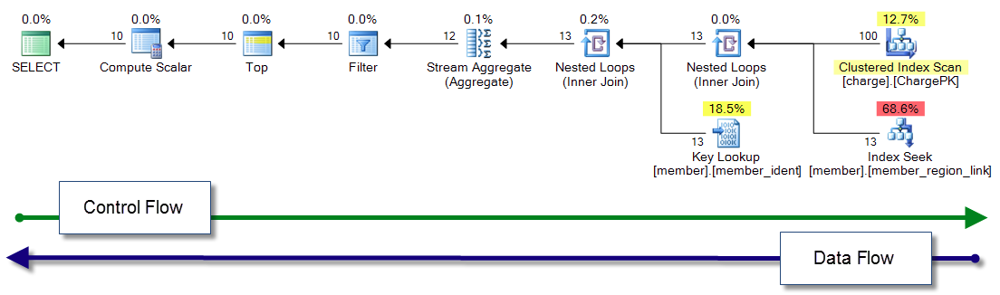

### Tools:
[SentryOne Plan Explorer - SQL Server Query Tuning](https://www.sentryone.com/plan-explorer)

### DMVs:
- sys.dm_exec_cached_plans
- sys.dm_exec_query_stats
- sys.dm_exec_procedure_stats
- sys.dm_exec_query_plan
- sys.dm_exec_sql_text

### Query Tree:

### Common Operators: [*link*](https://docs.microsoft.com/en-us/sql/relational-databases/showplan-logical-and-physical-operators-reference)

**Scans**:
-  **Table Scan**
-  **Clustered Index Scan** 
-  **Index Scan** 

**Seeks**:
-  **Clustered Index Seek** 
-  **Index Seek** 

**Lookups**:
-  **Key Lookup** 
-  **RID Lookup** 

**Joins**:
-  **Nested Loops** *(HINT: LOOP JOIN)*
-  **Merge Join** 
-  **Hash Match** *(HINT: HASH JOIN)*

**Spools:** *The **Spool** operator saves an intermediate query result to the **tempdb** database*.
-  **Eager Spool**
-  **Lazy Spool**

**Parallelism**:
-  **Distribute Streams**
-  **Repartition Streams**
-  **Gather Streams**
-  **Bitmap**

 **Stream Aggregate** *(GROUP BY)*

 **Filter** *(HAVING)*

 **Sort** *(ORDER BY)*

 **Compute Scalar**: *(function expression)*

 **Concatenation** *(UNION ALL)*
