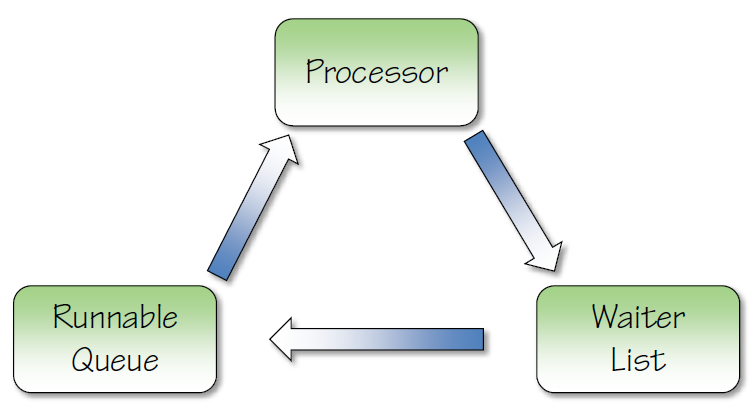
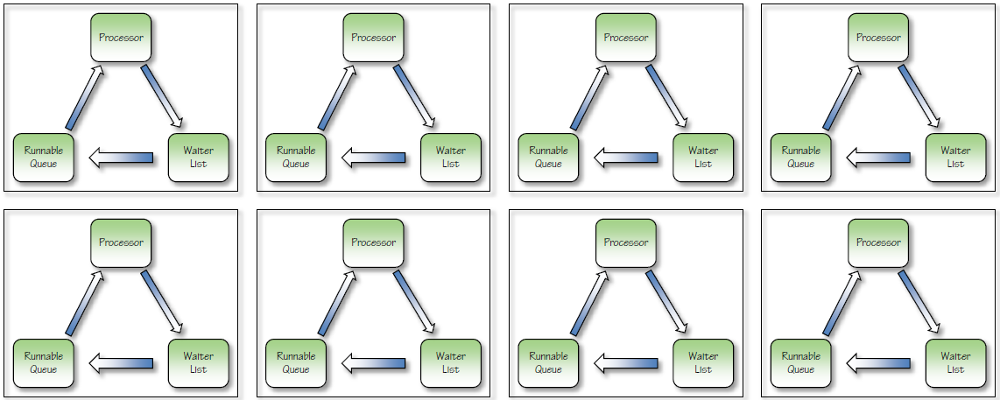

[SQL Server: Performance Troubleshooting Using Wait Statistics | Pluralsight](https://www.pluralsight.com/courses/sqlserver-waits)

## Thread Scheduling
- SQL Server performs its own thread scheduling 
  + Called non-preemptive scheduling 
  + More efficient (for SQL Server) than relying on Windows scheduling 
  + Performed by the SQLOS layer of the Storage Engine 
 
- Each processor core (whether logical or physical) has a scheduler 
  + A scheduler is responsible for managing the execution of work by threads 
  + Schedulers exist for user threads and for internal operations 
  + Use the sys.dm_os_schedulers DMV to view schedulers 
 
- When SQL Server has to call out to the OS, it must switch the calling thread to preemptive mode so the OS can interrupt it if necessary

## Components of a Scheduler
- All schedulers are composed of three "parts"

- Threads transition around these parts until their work is complete

## Schedulers in SQL Server
- One scheduler per logical or physical processor core
  + Plus some extra ones for internal tasks and the Dedicated Admin Connection
- For example, for a server with four physical processor cores, with hyper-threading enabled, there will be eight user schedulers


### Examining Schedulers:
```sql
SELECT * FROM sys.dm_os_schedulers;
GO
```

## Thread States
- A thread can be in one of three states when being actively used as part of processing a query
- RUNNING
  + The thread is currently executing on the processor
- SUSPENDED
  + The thread is currently on the Waiter List waiting for a resource
- RUNNABLE
  + The thread is currently on the Runnable Queue waiting to execute on the processor
- Threads transition between these states until their work is complete

### Examining Tasks:
```sql
SELECT
	 [ot].[scheduler_id]
	,[task_state]
	,COUNT(*) AS [task_count]
FROM sys.dm_os_tasks AS [ot]
INNER JOIN sys.dm_exec_requests AS [er] ON [ot].[session_id] = [er].[session_id]
INNER JOIN sys.dm_exec_sessions AS [es] ON [er].[session_id] = [es].[session_id]
WHERE [es].[is_user_process] = 1
GROUP BY [ot].[scheduler_id], [task_state]
ORDER BY [task_state], [ot].[scheduler_id];
GO
```

### Examining Waiting Tasks:
[*open link*](ExaminingWaitingTasks.sql)

### Examining Waits:
[*open link*](ExaminingWaits.sql)

### Examining Latches:
[*open link*](ExaminingLatches.sql)

### Examining Spinlocks:
[*open link*](ExaminingSpinlocks.sql)
